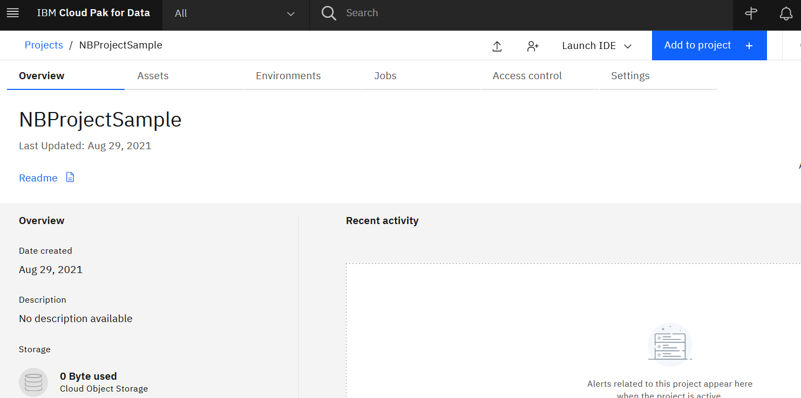
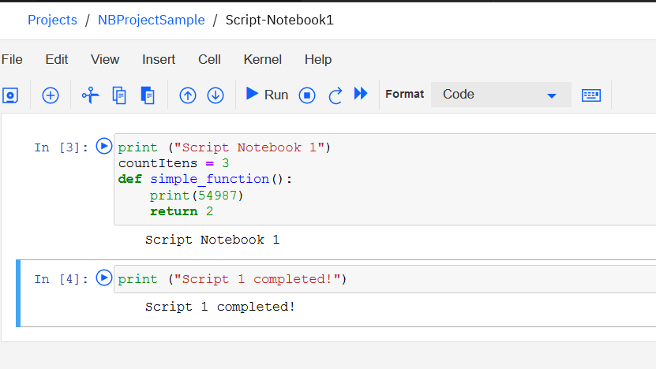
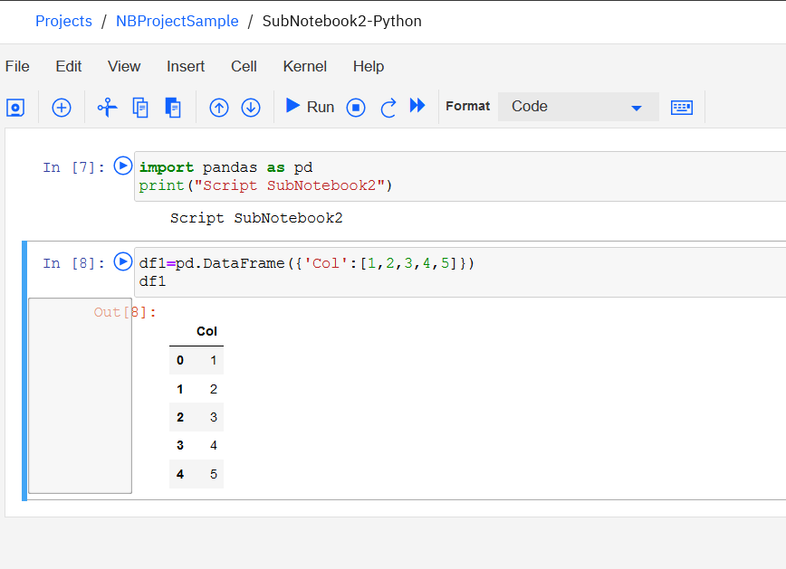

# How to execute a Jupyter Notebook from another Notebook from within IBM Watson Studio

The purpose of this tutorial is to show you how to run a notebook from another notebook using IBM Watson Studio.

Many projects with python coding are launched from the command line and split into multiple files. This division into files facilitates source code version management and reuse through classes and functions. Usually the project has a main file with python script responsible for executing all other python script files. Its main function is to collect the results of all executions and then generate an output with a single result.

When these projects are migrated to notebooks a rework of the python developer is required to adapt the code to the new format with cells and comments generating a significant impact on the visualization and debugging of code compared to the classical programming method.

The steps below demonstrate a practical example applied in a project with python that can be replicated to other projects with similar architecture **where a main notebook jupyter  will run two other notebooks**.

You can create a project from scratch using WatsonStudio from IBM Cloud or IBM Cloud Pak for Data onpremise.  
The steps are the same for both products.


**1)** Access the https://dataplatform.cloud.ibm.com. If you don't have an IBM cloud account yet, you can create a free account to access the project.  


**2)** Once logged in, you must click on the link that appears in the center of the screen to **create a project**.


**3)** Click **"Create an empy project"** to create a new project


**4)** Choose a project name. For example **`NBProjectSample`** and then click the **Create** button.


**5)** After creating the project, let's add the first notebook that will be the main notebook responsible for running the other notebooks. Click on the **"Add to Project"** button and choose "Notebook".

  


  

**6)** Name the main Notebook, for example **`Notebook-Main`**.

  


**7)** When the notebook screen opens, you are ready to start python encoding.

  


**8)** The first step is to get the token to access the project files. It can be done in the menu on the right under the option **"Insert project token"**

  


**9)** This project probably does not have any token created yet if the following message appears. If that's the case, let's create a new token by clicking on the project name **`NBProjectSample`**.

  


**10)** Click on "New token +" and create a new token with the name **`NBProjectSample-token`** and choose the option **Editor**.

  

 


**11)** Go back to the **`NBProjectSample`** project screen and add the token created to access the project files. It can be done in the menu on the right under the option **"Insert project token"**

**12)** The first cell will be filled with the project token.  
**Avoid sharing the **`project_id`** and **`project_access_token`** **to prevent unauthorized access.**

 


**13)** Create 3 cells to add python coding.

**14)** Copy and paste the python script below into the first cell you created.

```python
PROJECT_ID='<YOUR_PROJECT_ID>'
PROJECT_ACCESS_TOKEN='<YOUR_PROJECT_ACCESS_TOKEN>'
COS_ENDPOINT = project.get_metadata()['entity']['storage']['properties']['endpoint_url']
COS_ACCESS_KEY_ID = project.get_metadata()['entity']['storage']['properties']['credentials']['editor']['access_key_id']
COS_SECRET_ACCESS_KEY = project.get_metadata()['entity']['storage']['properties']['credentials']['editor']['secret_access_key']
BUCKET_NAME = project.get_project_bucket_name()
```

 


**15)** Replace the text **"<YOUR_PROJECT_ID>"** with the value of the **`project_id`** parameter found in the first cell and replace the text **"<YOUR_PROJECT_ACCESS_TOKEN>"** with the value of the **`project_access_token`** parameter found in the first cell.

 


**16)** Copy and paste the script below into a new cell

```python
import boto3, sys, json
from project_lib.utils import ProjectHandle
from project_lib.proxies import APIProxyFactory
local_handle = ProjectHandle(PROJECT_ID,PROJECT_ACCESS_TOKEN)
local_api_proxy_factory = APIProxyFactory(local_handle)
local_assetsAPI = local_api_proxy_factory.newAssetsAPI()
notebook_list = []
for nb in project.get_assets():
    if (nb.get("type") == 'notebook'):
        local_nb_asset = local_assetsAPI.fetch_asset(nb['asset_id'])
        notebook_list.append([local_nb_asset['metadata'].get("name"), local_nb_asset['attachments'][0].get("object_key")])
cos_client = boto3.client('s3', aws_access_key_id=COS_ACCESS_KEY_ID, aws_secret_access_key=COS_SECRET_ACCESS_KEY,endpoint_url=COS_ENDPOINT)
for nb in notebook_list:
   file = cos_client.get_object(Bucket = BUCKET_NAME, Key = nb[1])
   jfile = json.loads(file["Body"].read())
   script_filename = nb[0] + '.py'
   script_file = open(script_filename, 'w') 
   script_file.write("#COS-filename "+nb[1]+"\n")
   if jfile["nbformat"] >=4:
      for i,cell in enumerate(jfile["cells"]):
         script_file.write("#cell "+str(i)+"\n")
         for line in cell["source"]:
            script_file.write(line)
         script_file.write('\n\n')
   else:
      for i,cell in enumerate(j["worksheets"][0]["cells"]):
         script_file.write("#cell "+str(i)+"\n")
         for line in cell["input"]:
             script_file.write(line)
         script_file.write('\n\n')
   script_file.close()
```

 


**17)** Add the script below to list the project files in a new cell

```python
!ls -lrt
```

 


**18)** Run all cells through the Cell menu.

 


**19)** After execution is complete, the last cell will display the only file named **Notebook-Main.py**.


 


Until this step the main script was prepared to call others notebooks.  
In the next step we will add new notebooks that will be called by the main notebook.


**20)** On the top menu, click on the name of the **`NBProjectSample`** Project and on the project window, click on the **New Notebook** link

 


**21)** Create a new notebook named **`Script-Notebook1`**

 


**22)** In the **`Script-Notebook1`** notebook, let's insert the following script in 2 cells

```python
#Cell 1
print ("Script Notebook 1")
countItens = 3
def simple_function():
    print(54987)
    return 2
```

```python
#Cell 2    
print ("Script 1 completed!") 
```

 


**23)** Run all cells through the Cell menu.

**24)** Let's create a second notebook named **`SubNotebook2-Python`**. To do this, go to the top menu to click on the name of the **`NBProjectSample`** Project and in the project window, click on the **New Notebook** link


**25)** In the **`SubNotebook2-Python`** notebook, let's insert the following script in 2 cells

```python
#Cell 1
import pandas as pd
print("Script SubNotebook2")
```

```python
#Cell 2
df1=pd.DataFrame({'Col':[1,2,3,4,5]})
df1
```




**26)** Let's go back to the notebook with the name **`Notebook-Main`** to insert new cells and call the notebooks that were created. Choose the pencil on the right side to **edit the notebook**.


**27)** Let's add 3 new cells and put the following script in each one of them.

```python
#Cell 1
%run Script-Notebook1.py
```

```python
#Cell 2
simple_function()
```

```python
#Cell 3
%run SubNotebook2-Python.py
```


**28)** Run all cells through the Cell menu.


# Voila !!
**All python scripts have run successfully according to the sequence of commands in the cells and the result is shown in the main jupyter notebook. Note that the variable values are available for all scripts.**


**29)** It is also possible to view the script generated from each file.

```python
!cat Script-Notebook1.py
```


A disadvantage compared to using scripts in traditional programming mode is that it is not possible to work with error code returned from called scripts. A workaround is to create error-handling functions.

That's all! We've all the steps to demonstrate the execution of a notebook through another notebook jupyter.

**Jupyter Notebooks included in the project:**  

[Notebook-Main](Notebook-Main.ipynb)  
[Script-Notebook1](Script-Notebook1.ipynb)  
[SubNotebook2-Python](SubNotebook2-Python.ipynb)  


**ProjectLib Reference:**  

https://dataplatform.cloud.ibm.com/docs/content/wsj/analyze-data/project-lib-python.html


